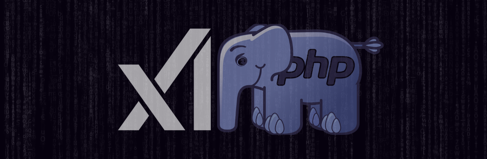

# 🧠 Grok PHP Client



**A lightweight, framework-agnostic PHP client for interacting with Grok AI APIs.**  
Supports **PHP 8.2+**, built with **OOP best practices**, and **fully type-safe**.

[](https://packagist.org/packages/grok-php/client)
[](https://php.net)
[](https://packagist.org/packages/grok-php/client)

[](LICENSE)

---

## 📖 Table of Contents
- [✨ Features](#-features)
- [📦 Installation](#-installation)
- [🚀 Quick Start](#-quick-start)
  - [Basic Usage](#basic-usage)
  - [Advanced Configuration](#advanced-configuration)
- [📌 Available Grok AI Models](#-available-grok-ai-models)
- [⚡ Streaming Responses](#-streaming-responses)
- [🧪 Testing](#-testing)
- [🔒 Security](#-security)
- [🤝 Contributing](#-contributing)
- [📄 License](#-license)

---

## ✨ Features


✅ **Plug & Play** – Quickly integrates with Grok AI APIs.  
✅ **Type-Safe & Modern** – Fully utilizes **PHP 8.1+ features** like enums, traits, and interfaces.  
✅ **Works Everywhere** – Compatible with **CLI scripts, APIs, and any PHP project**.  
✅ **Streaming Ready** – Built-in support for **streaming API responses**.  
✅ **Lightweight & Optimized** – No unnecessary dependencies, **PSR-4 autoloading**.

---

## 📦 Installation

Install via **Composer**:
```sh
composer require grok-php/client
```

### Requirements:

- PHP 8.1+
- Composer 2.0+

## 🚀 Quick Start

### Basic Usage

```php
use GrokPHP\Client\Clients\GrokClient;
use GrokPHP\Client\Config\GrokConfig;
use GrokPHP\Client\Config\ChatOptions;
use GrokPHP\Client\Enums\Model;

// Initialize the client
$config = new GrokConfig('your-api-key');
$client = new GrokClient($config);

// Define messages
$messages = [
    ['role' => 'system', 'content' => 'You are an AI assistant.'],
    ['role' => 'user', 'content' => 'Tell me a joke!']
];

// Call API
$options = new ChatOptions(model: Model::GROK_2, temperature: 0.7, stream: false);
$response = $client->chat($messages, $options);

echo "🤖 AI Response: " . $response['choices'][0]['message']['content'];
```

### 📌 Defaults Used:

- Model: grok-2
- Temperature: 0.7
- Streaming: false

---

### Advanced Configuration

```php
use GrokPHP\Client\Clients\GrokClient;
use GrokPHP\Client\Config\GrokConfig;
use GrokPHP\Client\Config\ChatOptions;
use GrokPHP\Client\Enums\Model;

// Load API key from environment
$apiKey = getenv('GROK_API_KEY');

$config = new GrokConfig($apiKey);
$client = new GrokClient($config);

// Define messages
$messages = [
    ['role' => 'system', 'content' => 'You are a helpful assistant.'],
    ['role' => 'user', 'content' => 'How do black holes form?']
];

// Custom API settings
$options = new ChatOptions(
    model: Model::GROK_2_LATEST,
    temperature: 1.2, 
    stream: false
);

$response = $client->chat($messages, $options);
echo "🚀 AI Says: " . $response['choices'][0]['message']['content'];
```
---

## 📌 Available Grok AI Models
Grok AI offers multiple models, each optimized for different use cases.
These models are available in the Model enum inside our package:
📄 `src/Enums/Model.php`

| Model Enum                  | API Model Name       | Description                                         |
|-----------------------------|----------------------|-----------------------------------------------------|
| `Model::GROK_VISION_BETA`     | grok-vision-beta     | Experimental vision-enabled model                   |
| `Model::GROK_2_VISION`        | grok-2-vision        | Advanced multi-modal vision model                   |
| `Model::GROK_2_VISION_LATEST` | grok-2-vision-latest | Latest iteration of Grok vision models              |
| `Model::GROK_2_VISION_1212`   | grok-2-vision-1212   | Enhanced vision model with performance improvements |
| `Model::GROK_2_1212`          | grok-2-1212          | Optimized chat model                                |
| `Model::GROK_2`               | grok-2               | Default general-purpose Grok model                  |
| `Model::GROK_2_LATEST`        | grok-2-latest        | Latest iteration of Grok-2                          |
| `Model::GROK_BETA`            | grok-beta            | Experimental beta model                             |

#### 📌 Default model used: `Model::GROK_2`
---

## ⚡ Streaming Responses
The Grok API supports streaming responses for real-time interaction.
Enable it by setting `stream: true`:

```php
$options = new ChatOptions(model: Model::GROK_2, temperature: 0.7, stream: true);
$response = $client->chat($messages, $options);
```
Streaming can be useful for chatbots, real-time applications, and CLI assistants.

---

## 🧪 Testing
Run tests using Pest PHP:

```sh
composer test
or
vendor/bin/pest
```

## 🔒 Security
If you discover a security vulnerability, please report it via email:
📩 [thefeqy@gmail.com](mailto:thefeqy@gmail.com)   

## 🤝 Contributing

Want to improve this package? Check out [CONTRIBUTING.md](CONTRIBUTING.md) for contribution guidelines.

## 📄 License

This package is open-source software licensed under the [MIT License](LICENSE).
